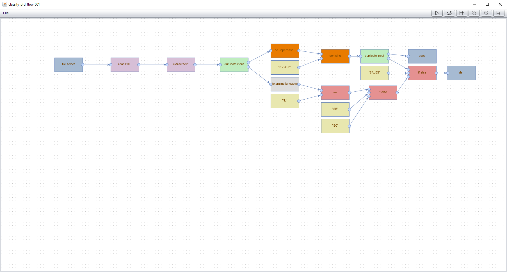

# anicitus : a picture is worth a thousand lines of code

This program implements a visual workflow builder, enabling quick proof-of-concepts to be built with off-the-shelf functionality.

# todo :
- documentation for blocks
- single jar build
- type safety
